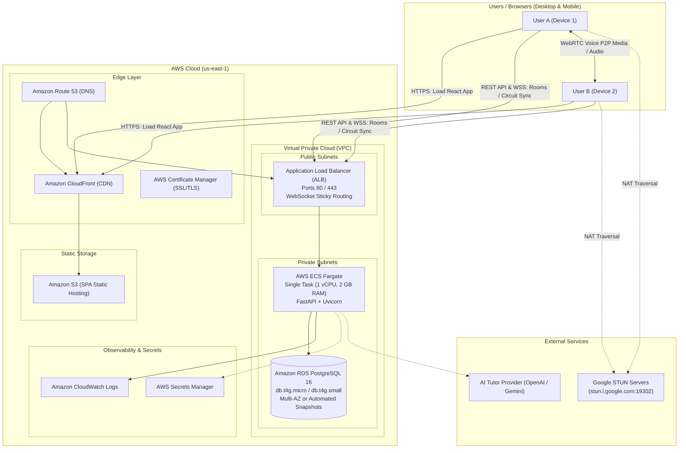

# QubitLab AWS Deployment Plan & Production Guide

This guide provides the complete, battle-tested blueprint for deploying **QubitLab** to Amazon Web Services (AWS) so that multiple real users on separate devices across the internet can:
1. Register and log in with JWT authentication
2. Add each other as friends and send private direct messages
3. Create and join real-time collaboration rooms via shareable invite links
4. Simultaneously view and edit the exact same quantum circuit with conflict-free revisions
5. Chat inside collaboration rooms
6. Conduct real voice calls via WebRTC

---

## 1. Architectural Architecture

Because QubitLab's real-time circuit synchronization and presence are managed through an in-memory WebSocket manager (`RoomManager` & `ChatManager` in FastAPI), **the backend is deployed as a single authoritative service instance** (or sticky sessions behind an ALB with WebSocket support).



---

## 2. Infrastructure Components & Sizing

| Component | AWS Resource | Recommended Spec | Monthly Cost (Est.) |
|---|---|---|---|
| **Frontend CDN** | Amazon CloudFront + S3 | Global Edge, SSL SNI | $1 - $5 |
| **Backend Container** | AWS ECS Fargate (Linux x86_64) | 1 vCPU, 2 GB RAM (1 task) | ~$25 |
| **Load Balancer** | Application Load Balancer (ALB) | Dual-AZ public subnets | ~$18 - $22 |
| **Database** | Amazon RDS PostgreSQL 16 | `db.t4g.micro` or `db.t4g.small` (gp3 20 GB) | ~$15 - $30 |
| **SSL Certificates** | AWS Certificate Manager (ACM) | Public wildcards `*.yourdomain.com` | Free ($0) |
| **DNS** | Amazon Route 53 | 1 Hosted Zone | ~$0.50 |
| **Secrets & Logs** | Secrets Manager + CloudWatch | Retention 14 days | ~$1 - $3 |
| **Total Estimated Run Cost** | | | **~$60 - $80 / month** |

---

## 3. Environment Variables Reference

### Frontend (`.env.production`)
Built into the Vite bundle during static build:
```bash
# Public API and WebSocket endpoints pointing to your ALB / Custom Domain
VITE_API_URL=https://api.yourdomain.com/api/v1
VITE_WS_URL=wss://api.yourdomain.com

# WebRTC ICE Servers (Optional JSON string; defaults to Google STUN if omitted)
# VITE_ICE_SERVERS='[{"urls":["stun:stun.l.google.com:19302","stun:stun1.l.google.com:19302"]}]'
```

### Backend (`AWS Secrets Manager` or ECS Task Environment)
```bash
# Core
APP_NAME=QubitLab
ENVIRONMENT=production
DEBUG=false
API_V1_PREFIX=/api/v1
PORT=8000
LOG_LEVEL=INFO

# Database (AWS RDS PostgreSQL connection string with asyncpg)
DATABASE_URL=postgresql+asyncpg://qubitlab_admin:<DB_PASSWORD>@<RDS_ENDPOINT>:5432/qubitlab

# JWT Security (Generate with: openssl rand -hex 32)
JWT_SECRET_KEY=<SECURE_64_CHAR_HEX_KEY>
JWT_ALGORITHM=HS256
ACCESS_TOKEN_EXPIRE_MINUTES=120
REFRESH_TOKEN_EXPIRE_DAYS=7

# CORS & Allowed Origins
CORS_ORIGINS=https://app.yourdomain.com,https://yourdomain.com
FRONTEND_URL=https://app.yourdomain.com

# AI Tutor Provider (Optional — rule-based fallback works if omitted)
AI_PROVIDER=openai
AI_API_KEY=sk-...
AI_MODEL=gpt-4o-mini

# Quantum Simulation Engine Limits
MAX_QUBITS=20
MAX_CIRCUIT_DEPTH=200
MAX_GATES=500
MAX_SHOTS=100000
SIMULATION_TIMEOUT_SECONDS=30
```

---

## 4. Security Groups & Network Architecture

### VPC Setup
- **VPC CIDR**: `10.0.0.0/16`
- **Subnets**:
  - `Public-Subnet-1` (`10.0.1.0/24`) in `us-east-1a`
  - `Public-Subnet-2` (`10.0.2.0/24`) in `us-east-1b`
  - `Private-Subnet-1` (`10.0.10.0/24`) in `us-east-1a`
  - `Private-Subnet-2` (`10.0.20.0/24`) in `us-east-1b`
- **Internet Gateway (IGW)** attached to VPC for public subnets.
- **NAT Gateway** in `Public-Subnet-1` so private ECS tasks can reach RDS, AWS Secrets Manager, and outbound AI APIs.

### Security Group Rules

#### 1. `qubitlab-alb-sg` (Application Load Balancer)
| Type | Protocol | Port | Source | Description |
|---|---|---|---|---|
| Inbound | TCP | 80 | `0.0.0.0/0` | HTTP (Redirect to HTTPS) |
| Inbound | TCP | 443 | `0.0.0.0/0` | HTTPS & WSS traffic from users |
| Outbound | TCP | 8000 | `qubitlab-ecs-sg` | Forward requests to backend container |

#### 2. `qubitlab-ecs-sg` (FastAPI ECS Fargate Task)
| Type | Protocol | Port | Source | Description |
|---|---|---|---|---|
| Inbound | TCP | 8000 | `qubitlab-alb-sg` | Accept HTTP & WebSockets from ALB only |
| Outbound | TCP | 5432 | `qubitlab-rds-sg` | Connect to PostgreSQL RDS |
| Outbound | TCP | 443 | `0.0.0.0/0` | Outbound HTTPS (AI APIs, AWS APIs) |

#### 3. `qubitlab-rds-sg` (PostgreSQL Database)
| Type | Protocol | Port | Source | Description |
|---|---|---|---|---|
| Inbound | TCP | 5432 | `qubitlab-ecs-sg` | Accept DB connections from backend only |
| Outbound | All | All | None | Isolated database |

---

## 5. Step-by-Step Deployment Guide

### Phase 1: Database Provisioning (RDS PostgreSQL)

1. Create a DB Subnet Group across `Private-Subnet-1` and `Private-Subnet-2`.
2. Provision an **Amazon RDS PostgreSQL** instance:
   - **Engine**: PostgreSQL 16.x
   - **DB Instance Identifier**: `qubitlab-db`
   - **Master Username**: `qubitlab_admin`
   - **Master Password**: Generate secure random password
   - **DB Instance Class**: `db.t4g.micro` (or `db.t4g.small`)
   - **Storage**: gp3, 20 GB (autoscale up to 100 GB)
   - **VPC**: Select `qubitlab-vpc`
   - **Subnet Group**: Select DB Subnet Group
   - **Public Access**: `No`
   - **VPC Security Group**: `qubitlab-rds-sg`
   - **Initial Database Name**: `qubitlab`

### Phase 2: ECR Repository & Docker Image Build

1. Create an ECR repository:
   ```bash
   aws ecr create-repository \
     --repository-name qubitlab-backend \
     --region us-east-1
   ```

2. Authenticate Docker with ECR:
   ```bash
   aws ecr get-login-password --region us-east-1 | \
     docker login --username AWS --password-stdin <AWS_ACCOUNT_ID>.dkr.ecr.us-east-1.amazonaws.com
   ```

3. Build and push the production image:
   ```bash
   cd "/Users/helloteddy/Downloads/ELRA 2/backend"
   docker build -t qubitlab-backend:latest .
   docker tag qubitlab-backend:latest <AWS_ACCOUNT_ID>.dkr.ecr.us-east-1.amazonaws.com/qubitlab-backend:latest
   docker push <AWS_ACCOUNT_ID>.dkr.ecr.us-east-1.amazonaws.com/qubitlab-backend:latest
   ```

### Phase 3: Execute Database Migrations

Run the Alembic migrations against RDS using a one-off ECS task or from a bastion host:
```bash
# In an ECS RunTask or bastion shell:
export DATABASE_URL="postgresql+asyncpg://qubitlab_admin:<DB_PASSWORD>@<RDS_ENDPOINT>:5432/qubitlab"
alembic upgrade head
```
This automatically provisions all 24 production tables:
- `users`, `friendships`, `messages`
- `collab_rooms`, `room_members`, `room_invites`
- `circuits`, `circuit_versions`, `simulation_results`
- `learning_levels`, `projects`, `lessons`, `concepts`
- `challenges`, `submissions`, `achievements`, `user_achievements`
- `xp_transactions`, `learning_events`, etc.

### Phase 4: Application Load Balancer & ECS Fargate Service

1. **Create Target Group**:
   - Target type: `IP`
   - Protocol: `HTTP`, Port: `8000`
   - Protocol version: `HTTP1`
   - Health check path: `/health`
   - Health check interval: `30 seconds`
   - Healthy threshold: `2`, Unhealthy threshold: `3`
   - Attributes:
     - Enable **Stickiness** (type: `app_cookie` or `lb_cookie`, duration: 86400s)
     - Enable **Deregistration delay**: 30s

2. **Configure ALB Listeners**:
   - **Port 80**: HTTP → Redirect to HTTPS (Port 443) with status code `HTTP_301`
   - **Port 443**: HTTPS → Forward to Target Group (using ACM Certificate for `api.yourdomain.com`)
   - **Idle Timeout**: Set ALB idle timeout to **300 seconds** (to keep WebSocket connections open and avoid premature disconnects).

3. **ECS Task Definition**:
   - Launch type: `FARGATE`
   - CPU: `1024` (1 vCPU), Memory: `2048` (2 GB)
   - Task Role: `ecsTaskExecutionRole`
   - Container definition:
     - Image: `<AWS_ACCOUNT_ID>.dkr.ecr.us-east-1.amazonaws.com/qubitlab-backend:latest`
     - Port mappings: `8000/tcp`
     - Environment Variables: As listed in Section 3
     - Log configuration: `awslogs` → `/ecs/qubitlab-backend`

4. **ECS Service**:
   - Service type: `REPLICA`
   - Desired tasks: `1` (authoritative single instance for stateful WebSockets)
   - Networking: `Private-Subnet-1`, `Private-Subnet-2`
   - Security Group: `qubitlab-ecs-sg`
   - Load Balancer: Attach container `qubitlab-backend:8000` to target group created above.

### Phase 5: Frontend Build & S3 + CloudFront Deployment

1. **Build the Frontend with Production Envs**:
   ```bash
   cd "/Users/helloteddy/Downloads/ELRA 2"
   
   # Create production env
   cat << 'EOF' > .env.production
   VITE_API_URL=https://api.yourdomain.com/api/v1
   VITE_WS_URL=wss://api.yourdomain.com
   EOF

   npm run build
   # Outputs optimized static bundle to dist/
   ```

2. **Create S3 Bucket & Upload**:
   ```bash
   aws s3 mb s3://qubitlab-frontend-production --region us-east-1
   aws s3 sync dist/ s3://qubitlab-frontend-production/ --delete
   ```

3. **Configure CloudFront Distribution**:
   - Origin: `s3://qubitlab-frontend-production` with **Origin Access Control (OAC)**
   - Viewer Protocol Policy: `Redirect HTTP to HTTPS`
   - Custom SSL Certificate: ACM certificate for `app.yourdomain.com`
   - **Single Page App (SPA) Error Handling**:
     - Custom Error Response: HTTP Error `403` and `404` → Response Page Path `/index.html`, HTTP Response Code `200`.

### Phase 6: Route 53 DNS Configuration

| Record Name | Type | Target |
|---|---|---|
| `app.yourdomain.com` | `A` (Alias) | CloudFront Distribution (`dxxxx.cloudfront.net`) |
| `api.yourdomain.com` | `A` (Alias) | Application Load Balancer (`dualstack.qubitlab-alb.elb.amazonaws.com`) |

---

## 6. End-to-End Real Multi-User Verification Procedure

Once deployed, follow this exact checklist across two independent devices (e.g. Device 1 on Wi-Fi, Device 2 on Mobile 5G Hotspot):

1. **Sign-up & Login**:
   - Device 1: Open `https://app.yourdomain.com`, register `alice@example.com`.
   - Device 2: Open `https://app.yourdomain.com`, register `bob@example.com`.
   - Verify both receive valid JWT tokens and their dashboards load.

2. **Friend Request & Direct Chat**:
   - Device 1: Navigate to Social page, search for `bob@example.com`, send friend request.
   - Device 2: Receive realtime friend request notification, accept request.
   - Verify both users appear in each other's friends list as online.
   - Device 1: Send direct message `"Hello Bob, ready to collaborate?"`.
   - Device 2: Instantly receive the message in private chat without refreshing.

3. **Collaboration Room Creation & Live Invite Link**:
   - Device 1: Open Quantum Studio, click **Collaborate** → **Create Room**.
   - Copy the shareable invite link (format: `https://app.yourdomain.com/collaborate/join/<token>`).
   - Device 2: Open the invite link in browser.
   - Verify Device 2 joins the room as an editor, and Device 1 sees Device 2 in the Active Members list.

4. **Live Circuit Synchronization & Server Revisions**:
   - Device 1: Drag a Hadamard gate (`H`) onto qubit 0.
   - Device 2: Observe qubit 0 immediately update with the `H` gate in real-time.
   - Device 2: Add a `CNOT` gate between qubit 0 and qubit 1.
   - Device 1: Observe circuit state instantly reflect the Bell state circuit.
   - Device 1: Run Simulation → both participants view matching probability distribution results.

5. **WebRTC Voice Call**:
   - Device 1: Click **Start Call** in the collaboration room.
   - Device 2: Receive incoming call prompt and click **Join Call**.
   - Verify peer-to-peer audio streams establish cleanly via Google STUN traversal.
   - Verify Mute / Unmute toggles work for both participants.
   - Click **End Call** to cleanly tear down WebRTC peer connections.

---

## 7. Monitoring, Alerts & Disaster Recovery

1. **ALB & CloudWatch Alarms**:
   - Alarm on `HTTPCode_Target_5XX_Count > 5` over 5 minutes.
   - Alarm on `TargetResponseTime > 1.5s`.
   - Alarm on `UnHealthyHostCount >= 1`.

2. **Automated Database Backups**:
   - RDS automatic daily snapshots with 7-day retention.
   - Point-in-time recovery (PITR) enabled with 5-minute granularity.

3. **Zero-Downtime Deployment Command**:
   ```bash
   # Re-deploy new container image without terminating in-flight queries
   aws ecs update-service \
     --cluster qubitlab-cluster \
     --service qubitlab-backend \
     --force-new-deployment
   ```
