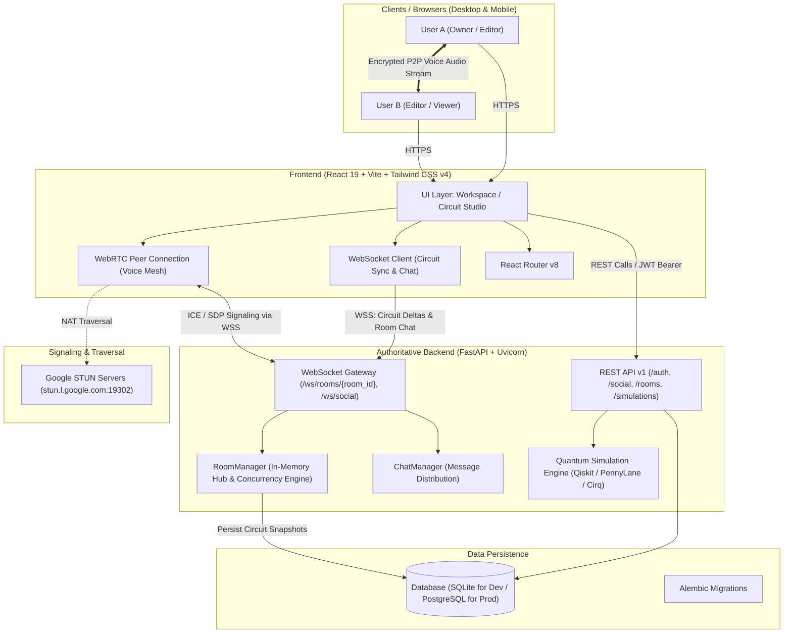

# QubitLab ⚛️
### Real-Time Collaborative Quantum Computing Platform & Interactive Lab

[](https://react.dev/)
[](https://www.typescriptlang.org/)
[](https://vitejs.dev/)
[](https://tailwindcss.com/)
[](https://fastapi.tiangolo.com/)
[](https://www.python.org/)
[](https://developer.mozilla.org/en-US/docs/Web/API/WebSockets_API)
[](https://webrtc.org/)
[](https://www.docker.com/)
[](https://pytest.org/)

**QubitLab** is an enterprise-ready, interactive quantum computing education and research platform. It brings together a multi-qubit visual circuit simulator, real-time multi-user collaboration rooms, peer-to-peer WebRTC voice communication, social direct messaging, gamified quantum curriculum, and AI-assisted tutoring.

---

## 📑 Table of Contents

- [Key Features](#-key-features)
- [System Architecture](#-system-architecture)
- [Tech Stack](#-tech-stack)
- [Project Layout](#-project-layout)
- [Quickstart Guide](#-quickstart-guide)
  - [Prerequisites](#prerequisites)
  - [1. Backend Setup](#1-backend-setup)
  - [2. Frontend Setup](#2-frontend-setup)
- [Testing Multi-User Collaboration](#-testing-multi-user-collaboration)
- [Testing & Quality Assurance](#-testing--quality-assurance)
- [Environment Configuration](#-environment-configuration)
- [Docker & Production Deployment](#-docker--production-deployment)
- [API Endpoints Overview](#-api-endpoints-overview)

---

## 🌟 Key Features

### 1. 🎛️ Quantum Circuit Studio
- **Multi-Qubit Visual Grid**: Drag-and-drop gate sequencing on up to 10 qubits with customizable gate depth.
- **Rich Gate Palette**:
  - Single-qubit gates: $H$, $X$, $Y$, $Z$, $S$, $T$, $P(\phi)$
  - Parameterized rotation gates: $R_x(\theta)$, $R_y(\theta)$, $R_z(\theta)$ with manual slider controls
  - Multi-qubit controlled gates: $CNOT$ ($CX$), $CZ$, $SWAP$, Toffoli ($CCX$)
  - Measurement operators: standard $Z$-basis measurements with shot distributions
- **Real-Time Mathematical Simulations**:
  - Full statevector computation and probability amplitude breakdown
  - Interactive 3D Bloch sphere representation for single-qubit state inspection
  - Probability histograms across computational basis states ($|00\dots\rangle$ to $|11\dots\rangle$)
  - Circuit exports to OpenQASM, Python (Qiskit / PennyLane / Cirq), and LaTeX

### 2. 👥 Real-Time Multi-User Collaboration Rooms
- **Instant Room Generation & Sharing**: Create rooms with one click; share secure 6-character room codes or direct invite links (`/join/:code`).
- **Live Circuit Synchronization**: Powered by authoritative FastAPI WebSockets. Every gate placement, parameter change, and deletion is broadcast live to all connected peers with revision numbering and optimistic UI updates.
- **Granular Role-Based Access Control (RBAC)**:
  - **Owner**: Full administrative controls (promote/demote members, transfer ownership, remove users, delete room).
  - **Editor**: Can manipulate circuit gates and parameters in real time.
  - **Viewer**: Read-only observation with live state tracking and chat.
- **Collaboration Chat**: Built-in room chat sidebar with message persistence and member presence.
- **🎙️ WebRTC Peer-to-Peer Voice Calling**: Integrated voice communication with zero third-party audio service costs. Features mute/unmute, participant talking indicators, and automatic ICE candidate exchange via WebSocket signaling.

### 3. 💬 Social Network & Direct Messaging
- **User Discovery & Profiles**: Search users by username or email, view profile badges, and track XP.
- **Friends System**: Send, accept, decline, and manage friend requests.
- **1-on-1 Direct Chat**: Instant real-time messaging between friends with unread indicators and chat history.
- **Global Presence**: Real-time online/offline status detection across the platform.

### 4. 🎓 Gamified Curriculum & Learning Path
- **Structured Modules**: Comprehensive curriculum covering Quantum Superposition, Entanglement, Quantum Teleportation, Grover's Search, and Shor's Algorithm.
- **Interactive Missions & Code Sandboxes**: Solve challenges directly in the circuit editor to complete objective checkpoints.
- **XP, Streaks & Leaderboards**: Earn experience points for solving challenges and compete on the global leaderboard.
- **Instructor Dashboard**: Dedicated instructor panel to assign tasks, grade student circuit submissions, and track learning progress.

### 5. 🤖 AI Quantum Tutor & "What-If" Engine
- **Context-Aware Tutor**: Ask conceptual or circuit-specific questions to get instant guidance.
- **"What-If" Analysis**: Run simulated counterfactual experiments (e.g., *"What happens to the entanglement if a phase flip gate is inserted before measurement?"*).

---

## 🏛️ System Architecture



---

## 💻 Tech Stack

### Frontend
| Technology | Version | Purpose |
|---|---|---|
| **React** | `19.0.0` | Declarative component UI library |
| **TypeScript** | `5.7.0` | Strict type safety and contracts |
| **Vite** | `8.0.5` | Next-generation frontend build tooling & hot-module reloading |
| **Tailwind CSS** | `v4.0.0` | Modern utility-first styling with native CSS variables |
| **React Router** | `8.3.1` | Client-side routing and deep-linking |
| **KaTeX** | `0.18.7` | High-fidelity mathematical formula and bra-ket notation rendering |
| **Recharts** | `3.10.1` | Responsive probability amplitude and measurement charts |
| **WebRTC API** | Browser Native | Ultra-low-latency peer-to-peer voice streaming |

### Backend & Simulation
| Technology | Version | Purpose |
|---|---|---|
| **Python** | `3.11` | High-performance backend runtime |
| **FastAPI** | `0.115.0` | Asynchronous REST and WebSocket web framework |
| **Uvicorn** | `0.30.0` | ASGI server with high concurrency capabilities |
| **SQLAlchemy** | `2.0.35` | Async ORM supporting SQLite and PostgreSQL |
| **Alembic** | `1.13.0` | Schema migrations and version control |
| **Pydantic** | `2.9.0` | Request validation and schema serialization |
| **Python-JOSE & Passlib** | `3.3.0` / `1.7.4` | JWT authentication and bcrypt password hashing |
| **Qiskit** | `1.2.0` | IBM Quantum computing SDK for circuit compilation |
| **PennyLane** | `0.38.0` | Differentiable quantum machine learning & simulation |
| **Cirq** | `1.4.0` | Google Quantum circuit simulation framework |
| **Pytest & Pytest-Asyncio** | `8.3.0` / `0.24.0` | Asynchronous unit and integration testing suite |

---

## 📂 Project Layout

```text
ELRA 2/
├── backend/                        # FastAPI Application
│   ├── app/
│   │   ├── api/v1/                 # API route controllers
│   │   │   ├── auth.py             # User signup, login, JWT issuance
│   │   │   ├── rooms.py            # Collaboration room CRUD, membership, invites
│   │   │   ├── routes.py           # Curriculum, assignments, submissions, XP
│   │   │   ├── simulations.py      # Quantum circuit execution & matrix export
│   │   │   ├── social.py           # Friends, friend requests, private chat
│   │   │   └── ws.py               # WebSocket endpoints (circuit, chat, voice signaling)
│   │   ├── core/                   # Security, settings, and database session setup
│   │   ├── models/                 # SQLAlchemy database models
│   │   ├── schemas/                # Pydantic schemas and serialization models
│   │   ├── services/               # Quantum simulators and background jobs
│   │   └── main.py                 # FastAPI application initialization & middleware
│   ├── migrations/                 # Alembic migration revisions
│   ├── tests/                      # 59 automated backend tests
│   ├── test_collab_features.py     # 29 end-to-end collaboration integration tests
│   ├── Dockerfile                  # Production container definition
│   ├── docker-compose.yml          # Containerized orchestration
│   └── requirements.txt            # Python dependencies
├── src/                            # React 19 Frontend
│   ├── components/                 # Reusable UI components
│   │   ├── CollabRoom.tsx          # Real-time collaboration UI (circuit, chat, voice call)
│   │   ├── ChatSidebar.tsx         # Slide-out real-time chat
│   │   ├── QuantumVisuals.tsx      # Bloch sphere, statevector & probability plots
│   │   ├── MathMarkdown.tsx        # LaTeX & KaTeX formula rendering
│   │   └── AppShell.tsx            # Navigation, topbar & responsive container
│   ├── pages/                      # Application views
│   │   ├── Workspace.tsx           # Quantum Circuit Studio & simulation canvas
│   │   ├── Social.tsx              # Friends list, requests & 1-on-1 private chat
│   │   ├── JoinInvite.tsx          # Deep-link invite landing handler (/join/:code)
│   │   ├── Learn.tsx               # Interactive quantum curriculum
│   │   ├── Challenges.tsx          # Daily missions and challenges
│   │   ├── Dashboard.tsx           # User overview, recent circuits & stats
│   │   ├── Instructor.tsx          # Instructor assignment & grading dashboard
│   │   ├── Login.tsx / Signup.tsx  # Authentication pages
│   │   └── Landing.tsx             # Public marketing landing page
│   ├── lib/                        # Client libraries & state managers
│   │   ├── api.ts                  # Typed Axios/Fetch client for REST endpoints
│   │   ├── auth.tsx                # React Auth context & token persistence
│   │   ├── ws.ts                   # WebSocket client & reconnect manager
│   │   └── sim.ts                  # Client-side quantum matrix evaluation
│   ├── App.tsx                     # Main router and route definitions
│   └── index.css                   # Global styles and Tailwind CSS v4 directives
├── package.json                    # Frontend dependencies & npm scripts
├── vite.config.ts                  # Vite configuration
└── AWS_DEPLOYMENT_PLAN.md          # Comprehensive AWS cloud deployment guide
```

---

## 🚀 Quickstart Guide

### Prerequisites
- **Node.js**: v18.0.0 or later (`node -v`)
- **npm** or **pnpm**: (`npm -v` / `pnpm -v`)
- **Python**: 3.11 (`python3 --version`)
- **Git**

---

### 1. Backend Setup

1. Open your terminal and navigate to the `backend` directory:
   ```bash
   cd backend
   ```

2. Create and activate a Python virtual environment:
   ```bash
   python3 -m venv .venv
   source .venv/bin/activate    # On Windows: .venv\Scripts\activate
   ```

3. Install the dependencies:
   ```bash
   pip install --upgrade pip
   pip install -r requirements.txt
   ```

4. Create your local `.env` configuration file:
   ```bash
   cp .env.example .env
   ```
   *(The default `.env` is pre-configured to use local SQLite with zero setup required.)*

5. Run database migrations:
   ```bash
   alembic upgrade head
   ```

6. Start the FastAPI development server:
   ```bash
   uvicorn app.main:app --reload --host 0.0.0.0 --port 8000
   ```
   - **Swagger API Documentation**: [http://localhost:8000/docs](http://localhost:8000/docs)
   - **Alternative ReDoc Docs**: [http://localhost:8000/redoc](http://localhost:8000/redoc)

---

### 2. Frontend Setup

1. In a separate terminal tab, navigate to the project root:
   ```bash
   cd ..   # From backend/ back to project root
   ```

2. Install Node dependencies:
   ```bash
   npm install
   ```

3. Start the Vite development server:
   ```bash
   npm run dev
   ```

4. Open your browser and navigate to:
   ```text
   http://localhost:8443
   ```
   *(or the port indicated in your Vite terminal output).*

---

## 👥 Testing Multi-User Collaboration

To test real-time multi-user features on your local machine:

1. **Open two separate browser environments**:
   - Browser A (e.g. Chrome normal window)
   - Browser B (e.g. Chrome Incognito window or Firefox)

2. **Register two distinct accounts**:
   - In Browser A, sign up as `alice` (`alice@example.com`).
   - In Browser B, sign up as `bob` (`bob@example.com`).

3. **Test Social & Friends**:
   - In Browser A, navigate to **Social**. Search for `bob` and click **Add Friend**.
   - In Browser B, navigate to **Social**. Accept Alice's friend request.
   - Send direct messages between both windows — messages and read statuses appear instantly!

4. **Test Collaboration Rooms & Live Circuit Synchronization**:
   - In Browser A, navigate to **Circuit Studio** and click **Start Collaboration** (or create a room from the Collaboration menu).
   - Copy the generated 6-character room code or the direct invite link (e.g., `http://localhost:8443/join/ABC123`).
   - In Browser B, paste the invite link or enter the room code.
   - **Drag and drop gates** in Browser A — observe Browser B update the circuit grid, statevector, and Bloch sphere in real time without refreshing.

5. **Test WebRTC Voice Calling**:
   - In both Browser A and Browser B, click **Start Voice Call** inside the collaboration room.
   - Grant microphone permissions when prompted.
   - Both users are joined into the peer-to-peer audio mesh. Test muting/unmuting to see live status updates.

---

## 🧪 Testing & Quality Assurance

The backend includes a comprehensive, battle-tested automated test suite ensuring circuit correctness, WebSocket sync stability, and RBAC authorization:

```bash
cd backend
source .venv/bin/activate

# 1. Run all unit and integration tests (59 tests)
pytest tests/ -v

# 2. Run real-time collaboration and role permission tests (29 tests)
python test_collab_features.py
```

### Test Coverage Highlights:
- **Authentication**: JWT generation, expiry, bcrypt hash verification, unauthorized access rejection.
- **Quantum Execution**: Unitary matrix evaluations, statevector normalization, probability distributions.
- **Collaboration Mechanics**:
  - Room lifecycle (create, invite, join, leave, delete).
  - Role transitions (Owner transfers, Editor promotions, Viewer restrictions).
  - Concurrent WebSocket broadcasts and circuit delta conflict resolution.
  - Room chat persistence and retrieval.

---

## ⚙️ Environment Configuration

### Backend (`backend/.env`)
| Variable | Default Value | Description |
|---|---|---|
| `PROJECT_NAME` | `QubitLab Backend` | Application display name |
| `SECRET_KEY` | *(Generated random string)* | Secret used to sign JWT tokens |
| `ALGORITHM` | `HS256` | JWT signing algorithm |
| `ACCESS_TOKEN_EXPIRE_MINUTES` | `10080` (7 days) | JWT lifetime before expiration |
| `DATABASE_URL` | `sqlite+aiosqlite:///./qubitlab.db` | SQLAlchemy async connection string |
| `CORS_ORIGINS` | `http://localhost:8443,http://localhost:5173` | Comma-separated allowed frontend origins |
| `STUN_SERVER_URL` | `stun:stun.l.google.com:19302` | STUN server for WebRTC NAT traversal |

### Frontend (`.env` or `.env.production`)
| Variable | Default Value | Description |
|---|---|---|
| `VITE_API_BASE_URL` | `http://localhost:8000` | REST API root endpoint |
| `VITE_WS_BASE_URL` | `ws://localhost:8000` | WebSocket gateway root endpoint |

---

## 🐳 Docker & Production Deployment

### Quick Docker Compose Deployment
QubitLab comes with containerization ready out of the box:

```bash
cd backend
docker compose up --build -d
```
This provisions:
- An optimized Python 3.11 FastAPI container running behind Uvicorn.
- A managed PostgreSQL database with automatic persistent volume mounting.

### AWS Cloud Production Guide
For multi-user public deployment on AWS:
- **Frontend**: Amazon S3 + Amazon CloudFront CDN with SSL/TLS via ACM.
- **Backend**: AWS ECS Fargate running the containerized FastAPI app behind an Application Load Balancer (ALB) with sticky WebSocket routing.
- **Database**: Amazon RDS PostgreSQL 16 (`db.t4g.micro` or `db.t4g.small`).

> 📘 **Detailed Step-by-Step Blueprint**: See [AWS_DEPLOYMENT_PLAN.md](file:///Users/helloteddy/Downloads/ELRA%202/AWS_DEPLOYMENT_PLAN.md) for full CloudFormation/Terraform patterns, VPC configuration, security group rules, and domain DNS setup.

---

## 📡 API Endpoints Overview

| Method | Path | Summary | Auth |
|---|---|---|---|
| `POST` | `/api/v1/auth/signup` | Register a new user | Public |
| `POST` | `/api/v1/auth/login` | Log in and receive JWT access token | Public |
| `GET` | `/api/v1/auth/me` | Fetch currently authenticated user | Bearer |
| `GET` | `/api/v1/social/friends` | List user's accepted friends | Bearer |
| `POST` | `/api/v1/social/friends/request` | Send a friend request | Bearer |
| `POST` | `/api/v1/social/friends/accept` | Accept a pending friend request | Bearer |
| `GET` | `/api/v1/social/messages/{user_id}` | Fetch 1-on-1 private chat history | Bearer |
| `POST` | `/api/v1/rooms/create` | Create a new collaboration room | Bearer |
| `POST` | `/api/v1/rooms/join/{code}` | Join a room using 6-character code | Bearer |
| `GET` | `/api/v1/rooms/{room_id}` | Retrieve room details & current circuit | Bearer |
| `PUT` | `/api/v1/rooms/{room_id}/circuit` | Save / update room circuit state | Bearer |
| `POST` | `/api/v1/simulations/run` | Execute quantum circuit simulation | Bearer |
| `WS` | `/ws/rooms/{room_id}` | Real-time circuit sync, room chat & WebRTC | Bearer |
| `WS` | `/ws/social` | Global presence & instant messaging gateway | Bearer |

---

## 📜 License & Acknowledgments

This project is licensed under the MIT License. Built with ❤️ for the quantum computing community, educators, and researchers worldwide.

